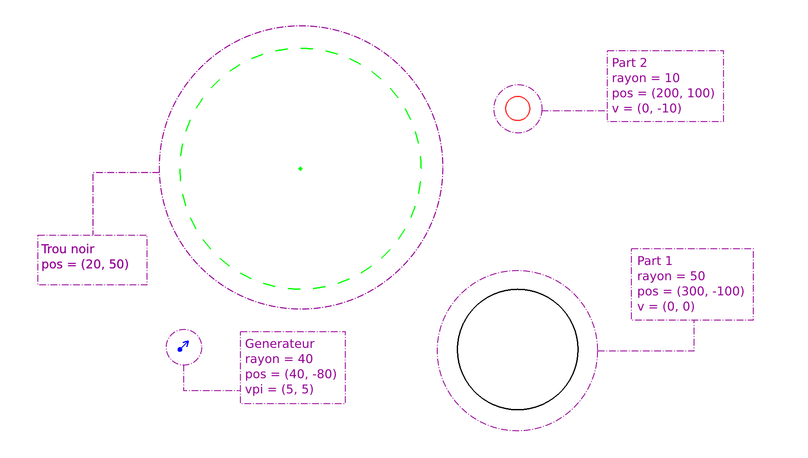
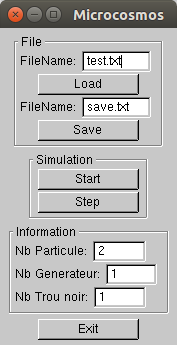

Microcosmos
===========

Just another cosmos simulation program
--------------------------------------

### Usage

    $./sim.x [option] test_file

#### Options

- *Simulation :* Just launch the simulation with the file passed as argument.
- *Error :* Check for syntax errors in the file passed as second argument.
- *Force :*
- *Integration :*
- *Graphic :*

### Screens

Simulation window with a test file opened.

GUI (with the same test opened).

